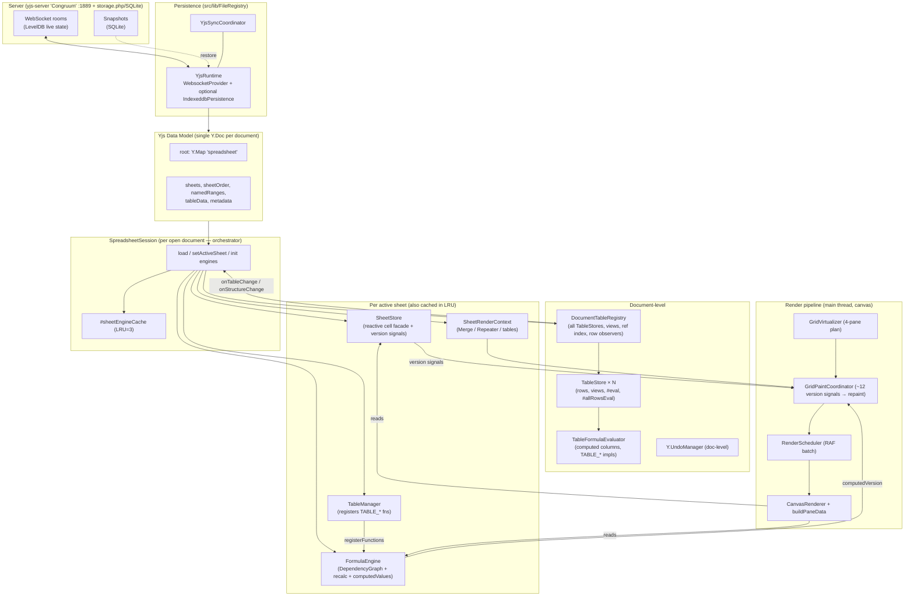
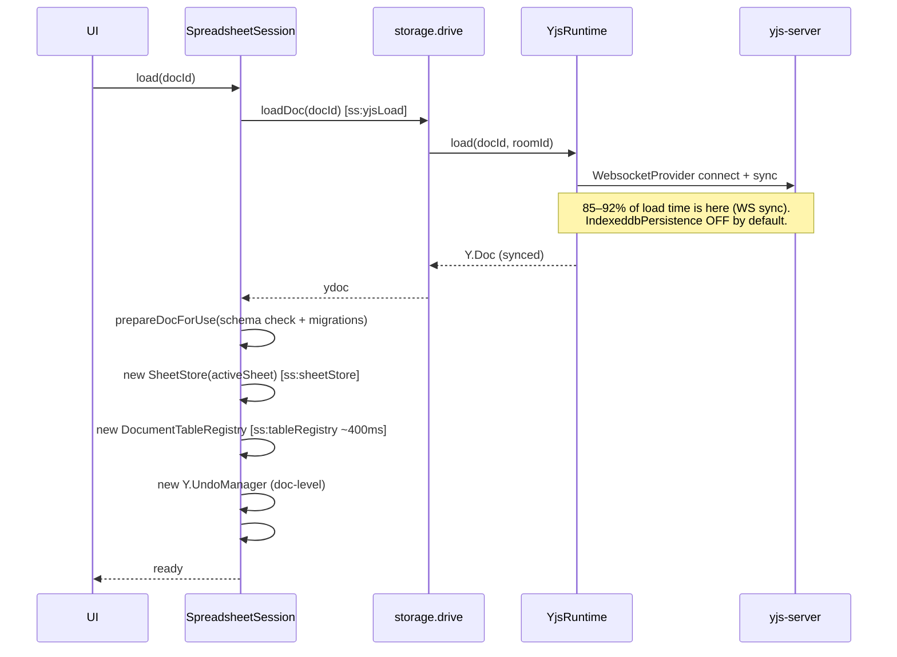
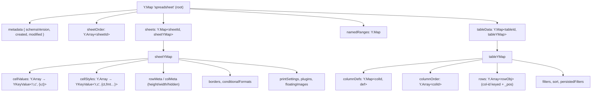
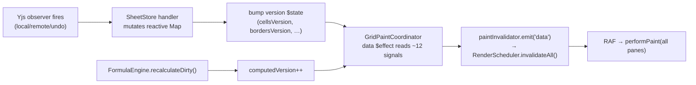
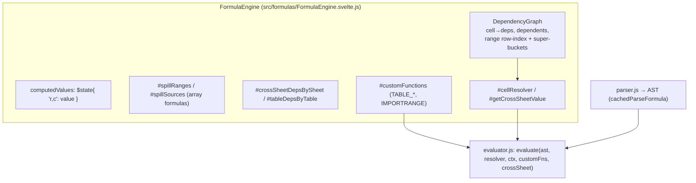
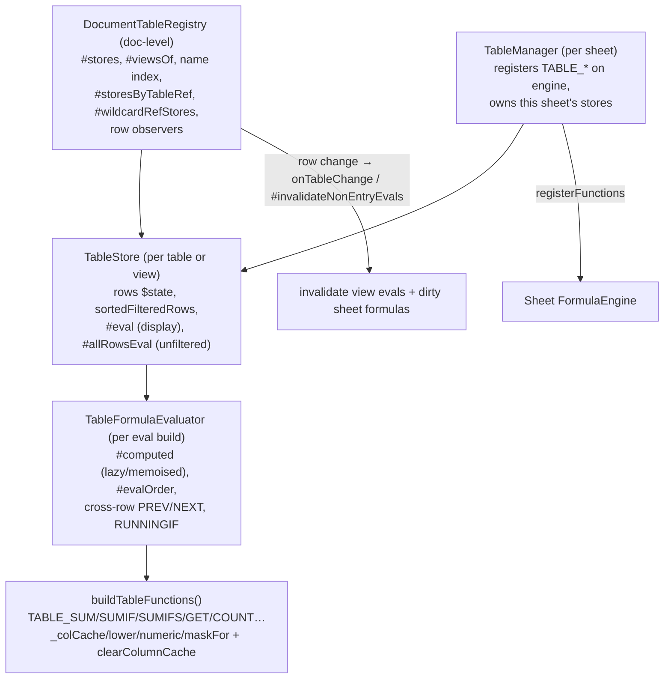
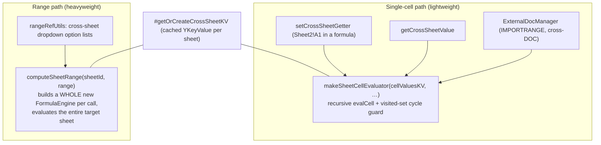
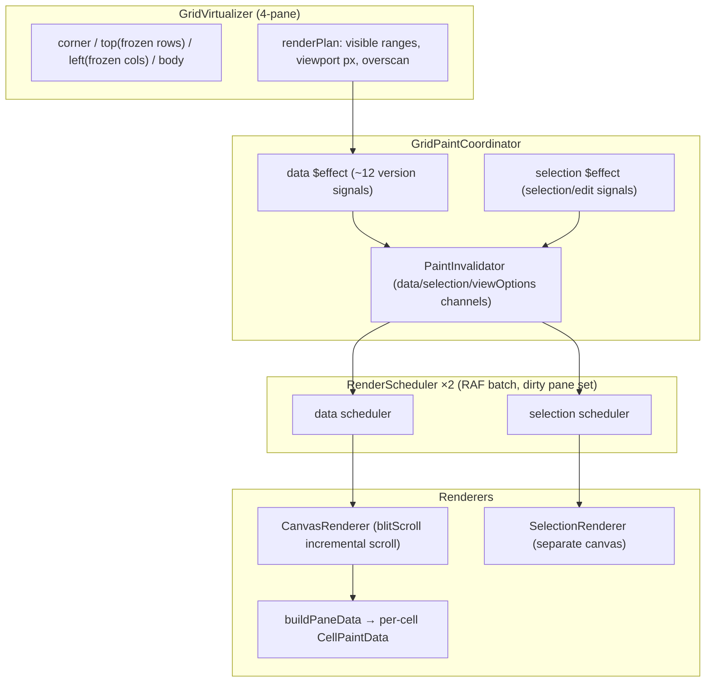
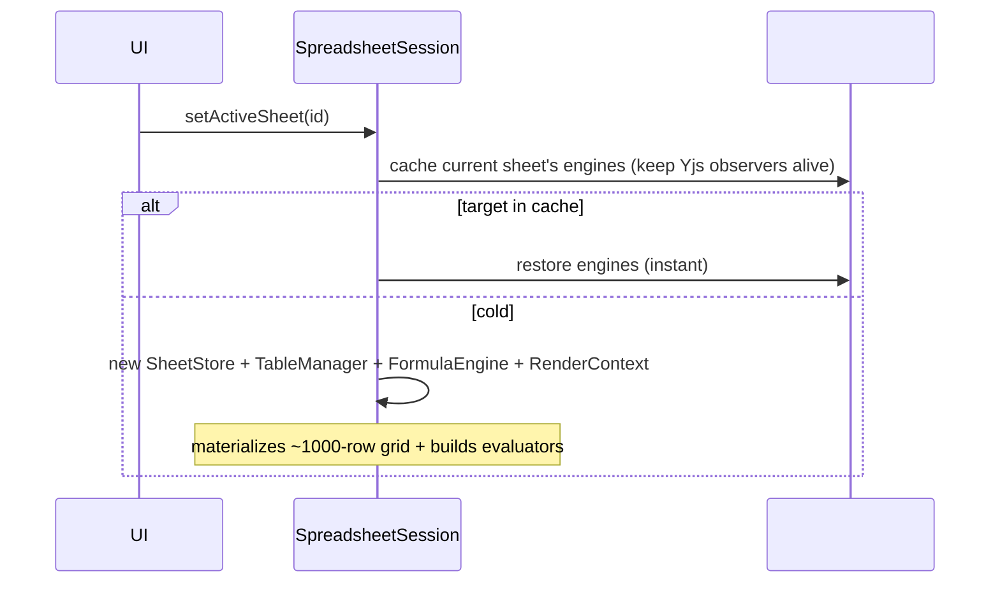
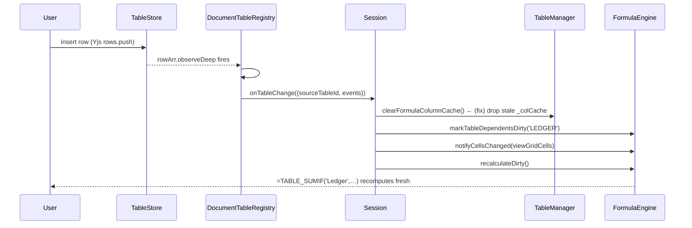

# Scriptorium Spreadsheet — System Architecture & Analysis

> Exhaustive map of the spreadsheet sub-app: persistence, data model, reactivity,
> formula evaluation, tables, cross-sheet/cross-doc, and the render pipeline —
> plus an architectural assessment. Diagrams are Mermaid (render in VS Code's
> Markdown preview / GitHub). File\:line references point at the current tree.

---

## 1. Bird's-eye map

**Two orthogonal "grids" the system must reconcile:**
1. **Sheet cells** — free-form grid data in `cellValues` (`{v,t}` per `"row,col"`), formulas in `v` starting with `=`, evaluated by **FormulaEngine**.
2. **Table data** — structured rows in `tableData[tableId].rows`, computed columns, rendered *into* grid coordinates through **views**, evaluated by **TableFormulaEvaluator**.

The bridge between them (a sheet formula reading a table cell, or `=TABLE_SUM(...)`) is where most of the complexity — and this month's bugs — live.

---

## 2. Persistence & loading

- **Transport:** `YjsRuntime` ([src/lib/FileRegistry/core/YjsRuntime.js](../src/lib/FileRegistry/core/YjsRuntime.js)) — `WebsocketProvider` (y-websocket) to the Congruum server, optional `IndexeddbPersistence` (**off by default**; full offline is opt-in).
- **Room rotation:** snapshot restore rotates a document's `roomId`; the runtime detects a "missed rotation" (device reopened under a new room) and drops orphaned offline edits (surfaced as a notice).
- **Schema:** `prepareDocForUse` runs a version check (read-only if the doc is newer than the client) + idempotent migrations. Schema version is stamped in `metadata`.
- **Known cost:** load is dominated by WS sync, not payload (contents gzip to ~26–28KB). A snapshot-first HTTP fast-path was **built and fully reverted** — the slow loads were a bad radio link, not the architecture. The real lever is **server-side** (LevelDB compaction / warm per-room cache).

---

## 3. Yjs data model

- **Cell value & formula share one field** `v` (formula ⇔ `v.startsWith('=')`). Type hint in `t`.
- **`cellValues`/`cellStyles` are `Y.Array` wrapped by `YKeyValue`** (y-utility) for map-like keyed access with CRDT semantics. Writes are **guarded** (`valuesEqual`, `compactBorderStyle`, strip-false styles) to avoid tombstone bloat — every `set` tombstones the old struct.
- **Tables are document-level** (`root.tableData`), *not* under a sheet. A sheet renders a table through a **view** (a `TableStore` with a `sourceStore`), placed at grid coordinates.
- **Views** store only `visibleColumns` + `persistedFilters`; rows are shared with the source.

---

## 4. Reactivity bridge (Yjs → Svelte 5 → canvas)

Svelte 5 runes (`$state`, `$derived`, `$effect`) drive the UI, but Yjs is the source of truth. The bridge is **version-counter signals**:

- **SheetStore** ([SheetStore.svelte.js](../src/stores/spreadsheet/SheetStore.svelte.js)): ONE observer per Yjs sub-collection → mutates a reactive `cells: Map` and bumps a matching version signal (`cellsVersion`, `bordersVersion`, `rowMetaVersion`, `colMetaVersion`, `cfVersion`, `pluginsVersion`, …). `#syncAllCells()` materializes **every** cell at load (not just visible).
- **Bulk data (`rows`, `cells`) are deep `$state` proxies** → per-property reads pay proxy-trap cost. This is the tax the table-eval materialization hit (partially addressed by iterating plain arrays in `getFullColumn`/`getColumn`).
- Repaint today is **coarse**: the data `$effect` reads ~12 signals and calls `invalidateAll()` (full 4-pane repaint). No dirty-rect for data changes (scroll has an incremental `blitScroll`).

---

## 5. Formula engine (per sheet)

**Recalculation** (`recalculateDirty`, [FormulaEngine.svelte.js:686](../src/formulas/FormulaEngine.svelte.js#L686)):
- Iterate-to-stable loop (max 100 iters) because spill outputs can dirty new cells.
- Dirty set cleared **before** eval so newly-dirtied cells accumulate for the next pass.
- Circular cells pre-marked `#CIRC!` so readers never see a stale number.
- Dependency graph uses a **two-tier range index** (per-row for spans ≤256, 256-row super-buckets for huge ranges like `SUM(A:A)`) so a changed cell finds its range-dependents in ~O(1).
- **Dep categories tracked separately:** direct cell refs (graph), cross-sheet (`#crossSheetDepsBySheet`), and table refs (`#tableDepsByTable`, with `'*'` wildcard for dynamic table names).

**Setting a formula** (`setFormula`): parse → `extractCellRefs` + `#updateCrossSheetDeps` + `#updateTableDeps` → graph edges → evaluate → `#storeResult` (handles spill).

---

## 6. Formula core (`src/formulas/`)

| File | Role |
|---|---|
| `parser.js` / `formulaParser.js` | Tokenize + parse to AST; `extractCellRefs`, `extractTableDeps` |
| `evaluator.js` | `evaluate(ast, …)` tree-walk; `cachedParseFormula` (AST memo) |
| `dependency-graph.js` | Cell dep graph, topo order, range indices, circular detection |
| `functions/`, `functions.js` | Built-in functions + `FormulaError` (`#REF!`, `#CIRC!`, …) |
| `refs.js` / `refCoords.js` / `refRewriter.js` | A1 ↔ coord, ref adjustment on row/col insert/delete |
| `dateCore.js` | `parseLocalDate` + date arithmetic |

Pure JS, no Svelte — Node-importable and unit-testable (and already imported by the Node-side `spreadsheet-api`).

---

## 7. Tables subsystem

- **DocumentTableRegistry** ([DocumentTableRegistry.svelte.js](../src/stores/spreadsheet/features/DocumentTableRegistry.svelte.js)): owns all `TableStore`s, tracks views (`#viewsOf`), a name index, and a **cross-table ref index** (`#storesByTableRef` + `#wildcardRefStores`). One row observer per unique rows Y.Array → `#invalidateNonEntryEvals(sourceId)` (rebuild affected table evals) + `onTableChange` (dirty sheet formulas).
- **TableStore** ([TableStore.svelte.js](../src/stores/spreadsheet/features/TableStore.svelte.js)): a table *or* a view. Two lazy evaluators — `#eval` (display order, filtered) and `#allRowsEval` (all rows, for `TABLE_*`/`getFullValue`). Views delegate `#allRowsEval` to their source. `#rebuildView` recomputes `sortedFilteredRows` and marks `#evalDirty`.
- **TableFormulaEvaluator** ([tableFormulaEval.js](../src/stores/spreadsheet/features/tableFormulaEval.js)): builds a per-cell `#computed` cache (now **lazy + memoised + cycle-guarded** — `#ensureCellComputed`), in column topo `#evalOrder`, with cross-row helpers. `buildTableFunctions` implements the `TABLE_*` functions with per-build column caches (`_colCache`, `lower`, `numeric`, `maskFor`) and a `clearColumnCache()` hook for the persistent sheet-engine registration.

**Computed columns** (`isNonEntry` / `defaultFormula`) can call `TABLE_SUMIFS('OtherTable',…)` → cross-table materialization through the registry resolver.

---

## 8. Cross-sheet & cross-document

There are **two** cross-sheet evaluation paths — a notable inconsistency:

- **`makeSheetCellEvaluator`** ([sheetCellEval.js](../src/stores/spreadsheet/sheetCellEval.js)): on-demand recursive single-cell resolver over a `cellValues` `YKeyValue`, with a shared `visited` set so multi-hop `Sheet1→Sheet2→Sheet1` cycles surface as `#CIRC!`. Used for in-formula refs and by `ExternalDocManager`.
- **`computeSheetRange`** ([SpreadsheetSession.svelte.js:1301](../src/stores/spreadsheet/SpreadsheetSession.svelte.js#L1301)): for the active sheet uses live values; **for any other sheet it constructs a `new FormulaEngine()` per call**, registers all `TABLE_*`/`IMPORTRANGE`, loads & evaluates the entire target sheet, then reads the range. Only caller is cross-sheet **dropdown option resolution** ([rangeRefUtils.js:51](../src/stores/spreadsheet/rangeRefUtils.js#L51)).
- **Cross-document**: `ExternalDocManager` + `IMPORTRANGE` pull ranges from *other* documents' Y.Docs.

---

## 9. Render pipeline (canvas, main thread)

- **GridVirtualizer** ([GridVirtualizer.svelte.js](../src/stores/spreadsheet/virtualization/GridVirtualizer.svelte.js)): computes a 4-pane render plan with frozen rows/cols, overscan, `$derived` axis ranges from scroll offset.
- **GridPaintCoordinator** ([GridPaintCoordinator.svelte.js](../src/components/spreadsheet/grid/GridPaintCoordinator.svelte.js)): owns two `CanvasRenderer`/`RenderScheduler` pairs (data + selection). The **data `$effect` reads ~12 version signals** and, on any change, `emit('data') → invalidateAll()`. Selection is a separate canvas/scheduler so cursor moves don't repaint data.
- **RenderScheduler**: RAF-coalesces invalidations into one paint per frame, tracking a dirty-pane set; `flush()` for sync paint (PDF/export).
- **CanvasRenderer**: paints panes; `blitScroll` shifts existing pixels for incremental scroll instead of full repaint. `buildPaneData` builds per-cell paint objects (values via `SheetStore`+`FormulaEngine`, styles, borders, merges, table grips, conditional formats).

---

## 10. Sheet switching & the LRU engine cache

- Up to **3** sheets keep their `SheetStore`/`FormulaEngine`/`TableManager`/`RenderContext` alive (observers attached, so cached sheets stay fresh). Restore is instant; a cache miss cold-builds everything.
- With **5 sheets and a 3-slot cache**, bouncing across sheets thrashes → repeated cold builds.

---

## 11. End-to-end: "insert a Ledger row" (why formulas must cascade)

---

## 12. Architectural assessment

### Strengths
- **Clean separation of pure formula core** (`src/formulas/*`) from reactive shells — worker-ready, testable, already reused server-side.
- **Sophisticated dependency graph** (two-tier range index, super-buckets, spill + circular handling, separate cross-sheet/table dep indices).
- **Canvas render pipeline** is strong: 4-pane virtualization, RAF batching, `blitScroll`, separate selection canvas.
- **CRDT hygiene**: write guards prevent tombstone bloat.
- **Lazy evaluators** so non-visible sheets/tables don't pay eval cost until referenced.

### Issues & risks (ranked)

| # | Severity | Issue | Where |
|---|---|---|---|
| 1 | ~~High~~ **Fixed** | Re-entrant table-eval rebuild cascade (dozens of full rebuilds per switch) | `TableStore.#ensureEval` — now publishes `#eval` before build + lazy `#computed` |
| 2 | ~~High~~ **Fixed** | Sheet-engine `TABLE_*` column cache never invalidated → stale grid formulas | `buildTableFunctions.clearColumnCache` + `onTableChange` |
| 3 | ~~Medium~~ **Fixed** | `onTableChange` refreshed only the active engine; cached sheets' `TABLE_*` went stale. Now `#forEachLiveEngine` fans the cache-clear + re-dirty + recalc across active + cached + warmed engines. | `onTableChange` / `onTableStructureChange` |
| 4 | ~~Medium~~ **Fixed** | `computeSheetRange`'s per-call throwaway engine removed — now reads from a warmed, cached FormulaEngine (`#getCrossSheetEngine`). | `#buildCrossSheetEngine` |
| 5 | ~~Medium~~ **Fixed** | Unified onto **one** cross-sheet mechanism: warmed real FormulaEngines per referenced sheet. `getCrossSheetValue`, `computeSheetRange`, and the active engine's cross-sheet getter all route through `#getCrossSheetEngine`; `makeSheetCellEvaluator` remains only for cross-**document** (ExternalDocManager). Full spill/cycle/TABLE_* parity. ⚠ needs live validation. | §8 |
| 6 | **Medium** | **Coarse repaint**: any of ~12 signals → full 4-pane `invalidateAll()`; no dirty-rect for data changes | `GridPaintCoordinator` data `$effect` |
| 7 | **Medium** | **Everything on the main thread** (formula engine, table eval, paint). Big edits/switches block input | whole app |
| 8 | **Low-Med** | **Deep `$state` proxies on bulk data** (`rows`, `cells`) → proxy-trap tax on materialization; `#syncAllCells` materializes every cell at load | `SheetStore`, `TableStore` |
| 9 | **Low-Med** | **LRU=3 vs 5 sheets** → cold-build thrash; cold switch still fully rebuilds (no cross-view sharing between two views of one table) | `#sheetEngineCache` |
| 10 | **Low** | Load dominated by WS sync; snapshot-first reverted — real lever is server-side | `YjsRuntime` / server |
| 11 | **Low** | Table-cell ↔ sheet-cell duality is bridged by coordinate mapping (`cellValueGetter` → `table.getValue`); powerful but the source of the re-entrancy class of bugs | §1, §11 |

### Recommendations (do these before a big rewrite)

1. **Close the cached-engine staleness gap (#3)** — make `onTableChange` iterate `#sheetEngineCache` (clear each cached `tableManager`'s column cache + dirty each cached engine), mirroring `onTableStructureChange`. *Small, correctness.*
2. **Collapse the two cross-sheet paths (#4/#5)** — have `computeSheetRange` reuse a cached engine when the sheet is in the LRU, and otherwise a memoized per-sheet engine; longer term, extend `makeSheetCellEvaluator` to resolve ranges (incl. spills) so there's one path.
3. **Dirty-rect repaint (#6)** — split the mega-`$effect` into per-region invalidations; repaint only changed cells/panes. Biggest perceived-perf win after the eval fixes.
4. **De-proxy bulk data (#8)** — store `rows`/`cells` as `$state.raw` (or plain + a single version signal); formula eval then iterates plain arrays. Structural fix for the proxy tax.
5. **Move the model to a worker (#7)** — the documented target: Document Worker owns Y.Doc + FormulaEngine + table eval; main thread keeps a read-model + virtualization + paint. Do this *after* 1–4 de-risk correctness.
6. **Server-side load (#10)** — profile `getYDoc` on the server; warm per-room cache / LevelDB compaction beats client snapshotting.

### Verdict
The core abstractions are sound; the pain is concentrated at the **table ↔ sheet bridge** and the **coarse repaint / main-thread** model. Items 1–4 are surgical correctness/perf wins that don't require re-architecture. A worker migration (5) is the one genuinely architectural change worth planning, and the pure formula core is already shaped for it. **No ground-up rewrite is warranted.**
